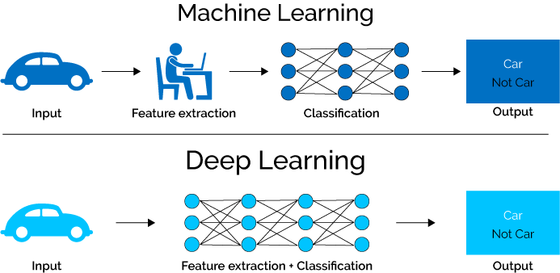
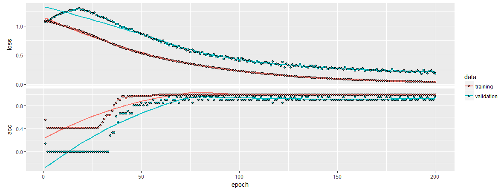

```{r setup, include=FALSE}
knitr::opts_chunk$set(echo = TRUE)
library(plyr)
library(tidyverse)
library(caret)
library(keras)
library(modelr)
library(doParallel)
library(caTools)

```

## Overview

Having just started playing with deeplearning models in R, I wanted to visually compare them to other more traditional ML workflows. Of course, deeplearning is generally used where other models fail, but with no need for feature selection and rapidly increasing power and ease of use they may just evolve into a general learning paradigm.  



However, with tabular data and packages like caret the machine learning methods have become so streamlined that minimal user input is required at all.  

How will my models score if I run all of them with minimal input?  

## Setting up the data

I will use a classical example of classification model to compare basic deeplearning MLP layouts to basic ML methods.

The good'ol `iris` dataset!

```{r}
iris %>%
  ggplot()+
  geom_point(aes(x=Petal.Width, y= Petal.Length, col = Species))+
  ggtitle("Good'ol iris!")
```

Lets load and split the Iris data into our test and train splits:  

```{r}
Model_benchmarking_table <- 
  iris %>%  mutate_if(is.factor,as.character) %>% modelr::crossv_kfold(k = 10, id = "fold_number") %>% 
  select(fold_number,everything()) %>% 
  rename(training_data = train)
```

Genrally we do not want to split the data like this in advance since our different models may require different pre-processing on the data. In some cases pre-processing is preffered before splitting the data into test and train sets.  

However splitting the data like this keeps all our folds in one tibble and allows us to expand on it like a database. We will use this database later to visualize the performance of the different methods on a more granular level.  

```{r}
Model_benchmarking_table
```

## Training functions

In order to run all our models in parallel and on each fold we will need to establish pre-defined functions for them that we can call using only data input. This way we can leverage map reduce and tibbles while keeping our workflow clean.  

First we will start off by building our basic ML model functions. This is made quite easy with the caret package.

The caret package workflow in this case consists of the following building blocks:  
- pre-process
- train-control
- train
- validate {ROC,Confusion_matrix etc.}

### ML models

For our caret models we can pre-define the formula object:

```{r}

formula_caret <- Species~.
cl = makeCluster(detectCores() - 1)
```

#### K-NN

```{r}
caret_knn <- function(df,formula_caret = Species ~ .) {
  
  list(
  
train(formula_caret
     ,data = df
     ,method = "knn"
     )
  )
}
```


#### Random Forest

Useful ensamble method.

```{r}

caret_rf <- function(df,formula_caret = Species ~ .) {
  
  list(
    
train(formula_caret
      ,df
      ,method = "rf"
      ,prox=TRUE
      )
  )
  
}

```


#### GBM

Gradient boosted machine, popular with tabular data predictions.

```{r}
caret_gbm <- function(df,formula_caret = Species ~ .) {
  
  list(
  
train(formula_caret
     ,data = df
     ,method = "gbm"
     )
  )
}
```

#### Caret nnet

```{r}
caret_nnet <- function(df,formula_caret = Species ~ .) {
  
  list(
    
 train(formula_caret
      ,df
      ,method = "nnet"
      ,prox=TRUE
      )
  )
  
}
```

## Train caret models

```{r,results = "hide",message =FALSE}
set.seed(8020)
doParallel::registerDoParallel(cl)

Model_benchmarking_table <- 
  Model_benchmarking_table %>% 
  mutate(
         random_forest = training_data %>% map(~caret_rf(df = data.frame(.x)))
         ,gradient_boosted_machine = training_data %>% map(~caret_gbm(df = data.frame(.x)))
         ,neural_network = training_data %>% map(~caret_nnet(df = data.frame(.x)))
         ,KNN = training_data %>% map(~caret_knn(df = data.frame(.x)))
  )
          
stopCluster(cl)
```

If we train the models like this we can store all our results in a tibble:  

```{r}
Model_benchmarking_table[,4:7]
```

This allows us wrangle performance metric for each crossvalidation fold or bootstrap sample so that we can visualize them holistically:  

## Measure performance

Now that we have trained the models on the training data let's make this table long

```{r}
Model_benchmarking_table <- 
  Model_benchmarking_table %>% 
  gather(key = "model_name",value = "model_object",4:7)

Model_benchmarking_table
```

Now we can measure accuracy by getting our predictions vs actuals and looking at the confusion matrix

```{r}
Model_benchmarking_table <- 
  Model_benchmarking_table %>% 
  mutate(actuals = test %>% map(~.x %>% data.frame %>% select(Species) %>% flatten_chr)) %>% 
  mutate(predicted = map2(test,model_object, ~predict(object = .y,newdata =  as.data.frame(.x)) %>% map(as.character) %>% flatten_chr)) %>% 
  mutate(confusion_matrix = map2(actuals,predicted,~table(.x,.y))) %>% 
  mutate(Accuracy = confusion_matrix %>% map_dbl(~ diag(.x) %>% sum/sum(.x)))

Model_benchmarking_table[,4:9]
```

We have all the info in our table now  

**Mean accuracy:**  

```{r}
Model_benchmarking_table %>% 
  group_by(model_name) %>% 
  summarise(mean_accuracy = mean(Accuracy))
```


## Plot performance

```{r}
Model_benchmarking_table %>% 
  ggplot()+
  geom_jitter(aes(x=fold_number,y=Accuracy,col = model_name))

Model_benchmarking_table %>% 
  ggplot()+
  geom_violin(aes(x=model_name,y=Accuracy,col = model_name))+
  # geom_point(aes(x=model_name,y=Accuracy,col = model_name))
  geom_jitter(aes(x=model_name,y=Accuracy,col = model_name), alpha = 0.5)
  # geom_boxplot(aes(x=model_name,y=Accuracy,col = model_name))
```

## Deeplearning model with keras

Now that we have a workflow to test various machine learning models on a dataset using a formula, let's build a basic deep learning model using a basic MLP layout and try to match those benchmarks.

If the neural network via caret is any indication this model should perform very well...  

### One hot encoding and pre-processing

Its classification and keras has the `to_categorical` function to help us turn that response variable into the deeplearning version of a sparse matrix so we can predict these classes.  

Remember to encode the classes as integers, not characters!  

```{r}
iris_data <- 
  iris %>% 
  mutate(Species = as.numeric(Species) -1) %>% 
  as.matrix()

 dimnames(iris_data) <- NULL
 
 iris_data_X <-  normalize(iris_data[,1:4])

 
set.seed(123)
split <- sample.split(iris$Species,SplitRatio=0.7)

data_train_X <- iris_data_X[split,]
data_test_X <- iris_data_X[!split,] 

data_train_Y <- iris_data[split,5] %>%  to_categorical()
data_test_Y <- iris_data[!split,5] %>%  to_categorical()


```

## Construct a basic MLP

To train any deeplearning model you need to construct layers of neurons, in this case no extra fluff!  

```{r}
model_keras <- keras_model_sequential() 

model_keras %>% 
    layer_dense(units = 8, activation = 'relu', input_shape = c(4)) %>% 
    layer_dense(units = 5, activation = 'relu') %>% 
    layer_dense(units = 3, activation = 'softmax')

model_keras
```

## Fit deep learning model

The model itself runs from gpu so I have only printed the output here in this document.  

```{r, echo=FALSE,include=FALSE,eval=FALSE}
model_keras %>% compile(
     loss = 'categorical_crossentropy',
     optimizer = 'adam',
     metrics = 'accuracy'
 )

history <- model_keras %>% keras::fit(object = .
                         ,x = data_train_X  
                         ,y = data_train_Y 
                         ,epochs = 200 
                         ,batch_size = 5 
                         ,validation_split = 0.2
                         )
```

## Get predictions

Normally we would calculate the confusion matrices ourselves or with `caret::confusionMatrix()`:  

```{r,eval=FALSE}
# Predict the classes for the test data
classes <- model_keras %>% predict_classes(data_test_X)

# Confusion matrix
cm <- table(iris_data[!split,5], classes)
```

One measure of accuracy would've been:   

```{r,eval=FALSE}
diag(cm) %>% sum/sum(cm)
```

But indeed straight from keras and tensorboard:  

```{r,eval=FALSE}
history %>% plot
```



It seems to be reporting the accuracy on its test split as:  

```{r, eval=FALSE}
history$metrics$val_acc %>% last()
```

`0.952381`

That seems to be in line with our average ratings across the auto-tuned ML libraries... Without needing feature selection. In a more complex dataset with hundreds of features (like pixels on frame of a video) it is obvious why these models perform so well.  

## Conclusion

Even for basic tabular data and classification (not a typical use case of deeplearning) we can get very good scores compared to out of box alternatives from some of the leading ML packages in R.

Deeplearning is definitely a top contender!

